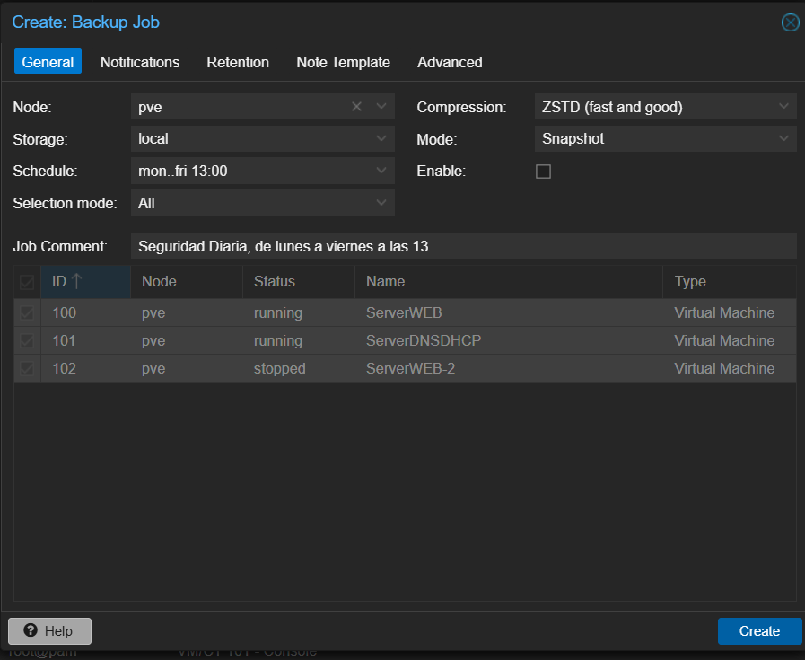
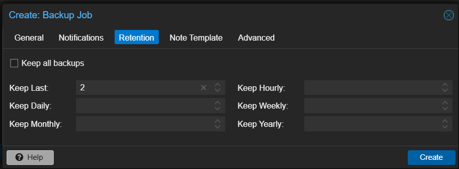
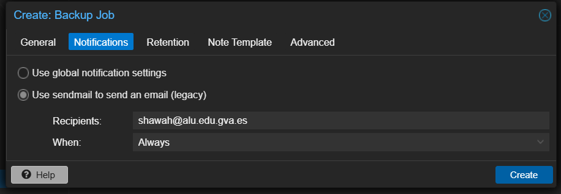
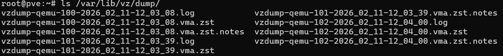
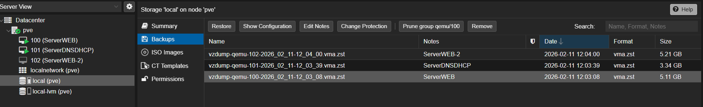
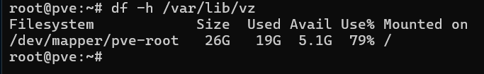
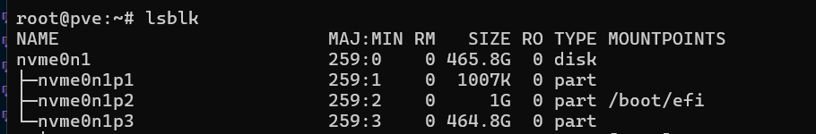
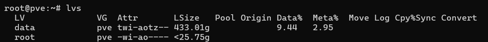
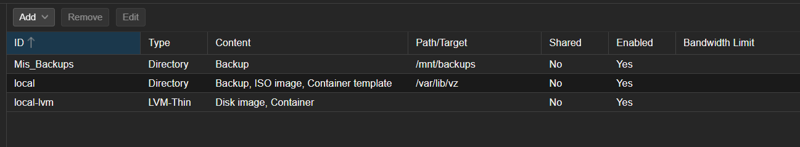

# Política de Copias de Seguridad (Backups) en Proxmox VE
Este documento detalla la estrategia de continuidad de negocio y recuperación ante desastres implementada en el clúster Proxmox. El objetivo es automatizar la protección de datos considerando el horario operativo del servidor (**Lunes a Viernes, 08:00 - 14:00**).

---

## 1. Conceptos Teóricos: ¿Cómo funcionan los Backups?
Proxmox VE integra una herramienta llamada `vzdump` que permite realizar copias de seguridad completas de máquinas virtuales (KVM) y contenedores (LXC).

### Archivos Generados

Cada vez que se realiza un backup, se generan tres archivos en el almacenamiento de destino:

1. 
**`.log`**: Registro completo de la operación (útil para auditoría).
2. 
**`.tar.zst`**: El backup real comprimido (contiene discos y configuración).
3. 
**`.notes`**: Metadatos y notas adicionales.

### Modo de Ejecución: Snapshot

Hemos seleccionado el modo **Snapshot** (Instántanea).
* **Funcionamiento:** Realiza la copia "en caliente".
* **Ventaja:** No es necesario apagar la máquina ni detener servicios. El sistema sigue operativo para los usuarios mientras se hace la copia en segundo plano.
* (Nota: Existen otros modos como `Stop` o `Suspend`, pero implican tiempo de inactividad, lo cual no es deseable en horario laboral ).

### Compresión: ZSTD
Utilizamos el algoritmo **ZSTD (Zstandard)**.

* Es el estándar recomendado por Proxmox.
* Ofrece un equilibrio excelente entre velocidad de compresión y tamaño final del archivo.
* Es mucho más rápido que GZIP, vital para terminar antes de las 14:00.

---

## 2. Estrategia de Copias (Plan Básico)

Debido a que el servidor se apaga diariamente a las 14:00, la programación es crítica.

| Parámetro | Configuración | Justificación |
| --- | --- | --- |
| **Horario** | `Lunes a Viernes, 13:00` | Se ejecuta 1 hora antes del apagado para asegurar que la tarea finalice correctamente. |
| **Almacenamiento** | `local` (Directorio) | Se guardan en el disco del propio servidor (`/var/lib/vz/dump`) por simplicidad inicial. |
| **Alcance** | `Todas las VMs` | Cualquier nueva máquina creada se incluirá automáticamente en la política de protección. |
| **Retención** | `Últimas 2 copias` | Política de rotación para conservar espacio en disco. Mantiene la copia de hoy y la de ayer. |

---

## 3. Pasos de Configuración

Para replicar o modificar esta tarea, seguir la siguiente ruta en la interfaz web:

1. Ir a **Centro de datos (Datacenter)** > **Respaldo (Backup)** > **Agregar**.
2. **Pestaña General:**
* **Node:** `pve`.
* **Storage:** `local`.
* **Schedule:** `mon..fri 13:00` (Formato Cal-Event).
* **Selection mode:** `All` (Incluir todas).
* **Mode:** `Snapshot`.
* **Compression:** `ZSTD (fast and good)`.


3. **Pestaña Retention (Retención):**
* **Keep Last:** `2`.


4. **Pestaña Notifications (Notificaciones) (Opcional):**
* **Mailer:** `Sendmail`.
* **Recipient:** Correo del administrador (ej: alumno).
* **Policy:** `Always` (Siempre avisar) o `On Error`.


---

## 4. Restauración y Verificación
### Ubicación de los archivos
Físicamente, los backups se encuentran en el servidor en la ruta:

```bash
/var/lib/vz/dump
```

### Cómo restaurar

1. Ir a la PVE `local` > **Backups**.
2. Seleccionar el archivo `.tar.zst` deseado.
3. Pulsar el botón **Restaurar (Restore)**.
4. Seleccionar el `Storage` de destino (ej: `local-lvm`) y asignar un nuevo ID si se desea clonar .


Aquí tienes la documentación completa, estructurada de forma lógica y lista para copiar y pegar en tu **README** o en el documento de tu proyecto.

He detallado el problema, el diagnóstico y la solución paso a paso con las explicaciones técnicas exactas de cada comando.

---

# 5. Solución al Error de Espacio en Backups de Proxmox

## 5.1. El Problema
Durante la ejecución de las tareas de copia de seguridad (Backups) automatizadas en Proxmox, el sistema arrojó el siguiente error crítico y abortó la operación:
`zstd: error 70 : Write error : cannot write block : No space left on device`

**Causa:** El almacenamiento por defecto de Proxmox para backups (`local` o `/var/lib/vz`) reside en la partición `root`. En nuestra instalación, esta partición tenía asignados solo **26 GB** de capacidad total, los cuales se llenaron rápidamente al intentar guardar copias de máquinas virtuales que ocupaban ~5 GB cada una.

---
## 5.2. Diagnóstico del Hardware y Volúmenes
Para entender cómo estaba repartido el disco físico y buscar una solución, se ejecutaron los siguientes comandos de diagnóstico por consola (Shell):

1. **Verificar el espacio libre real del directorio de backups:**
```bash
df -h /var/lib/vz
```


*Resultado:* Confirmó que el espacio disponible (`Avail`) era de apenas 5.1 GB, insuficiente para las tres máquinas.

2. **Verificar el disco físico completo:**
```bash
lsblk
```

*Resultado:* Mostró que el disco duro real (NVMe) era de 500 GB (`465.8G` utilizables), confirmando que había espacio físico de sobra.

3. **Verificar la distribución lógica de Proxmox (LVM):**
```bash
lvs
```

*Resultado:* Reveló que Proxmox había creado un volumen gigante llamado `data` (para discos virtuales) de **433 GB**, del cual **solo se estaba usando el 9.44%**.
**Estrategia:** En lugar de intentar redimensionar particiones en uso (lo cual es peligroso), la solución lógica fue "recortar" 100 GB de ese espacio inmenso y vacío de `data` para crear un disco duro virtual dedicado exclusivamente a las copias de seguridad.

---
## 5.3. Ejecución de la Solución (Consola de Proxmox)
Se ejecutaron los siguientes comandos como usuario `root` para crear y configurar el nuevo almacenamiento:

### PASO 1: Crear el nuevo volumen lógico
```bash
lvcreate -V 100G --thin -n storage_backups pve/data
```
* **Explicación:** `lvcreate` crea un nuevo Volumen Lógico. Le indicamos un tamaño de 100 GB (`-V 100G`), usamos el formato dinámico (`--thin`), lo nombramos `storage_backups` (`-n`) y le decimos que saque el espacio del contenedor gigante que nos sobraba (`pve/data`).

### PASO 2: Dar formato al disco
```bash
mkfs.ext4 /dev/pve/storage_backups
```
* **Explicación:** `mkfs.ext4` formatea el volumen recién creado con el sistema de archivos estándar de Linux (`ext4`). Esto es necesario para que el disco deje de ser un bloque en crudo y pueda guardar archivos (como los `.vma.zst` de los backups).

### PASO 3: Crear el punto de montaje y conectar el disco
```bash
mkdir -p /mnt/backups
mount /dev/pve/storage_backups /mnt/backups
```
* **Explicación:** Primero, creamos una carpeta física vacía en el sistema llamada `/mnt/backups`. Segundo, usamos `mount` para conectar ("enlazar") el disco virtual de 100 GB a esa carpeta. A partir de ahora, todo lo que caiga en esa carpeta irá al disco nuevo.

### PASO 4: Hacer el montaje permanente
```bash
echo "/dev/pve/storage_backups /mnt/backups ext4 defaults 0 2" >> /etc/fstab
```
* **Explicación:** Se añade una línea de configuración al archivo `/etc/fstab`. Esto asegura que si el servidor Proxmox se apaga o reinicia por un corte de luz, el disco de backups se volverá a montar y conectar automáticamente al arrancar.
---

## 5.4. Configuración en la Interfaz Gráfica (Web GUI)
Una vez preparado el almacenamiento físico, se le indicó a Proxmox cómo usarlo a través de su panel de administración web:

1. **Añadir el Directorio:** * Navegamos a *Datacenter -> Storage -> Add -> Directory*.
* **ID:** `Mis_Backups` (Nombre identificativo).
* **Directory:** `/mnt/backups` (La ruta exacta que montamos en el Paso 3).
* **Content:** Solo seleccionamos **Backup**. Esto restringe el uso del disco para que Proxmox no guarde ISOs ni otros archivos por error.


2. **Modificar la Tarea Automática:**
* Navegamos a *Datacenter -> Backup*.
* Editamos la tarea programada existente.
* Cambiamos el campo **Storage** del antiguo `local` al nuevo `Mis_Backups`.
---

## 5.5. Verificación Final

Se forzó la ejecución manual del backup programado (`Run now`). El sistema procesó las máquinas virtuales **ServerWEB (VM 100)**, **ServerDNSDHCP (VM 101)** y **ServerWEB-2 (VM 102)**.

El proceso concluyó con el mensaje de éxito **`TASK OK`**, guardando casi 13 GB de datos sin ningún corte de conexión ni error de almacenamiento, confirmando que la infraestructura ahora es estable y tolerante al tamaño de nuestras máquinas virtuales.