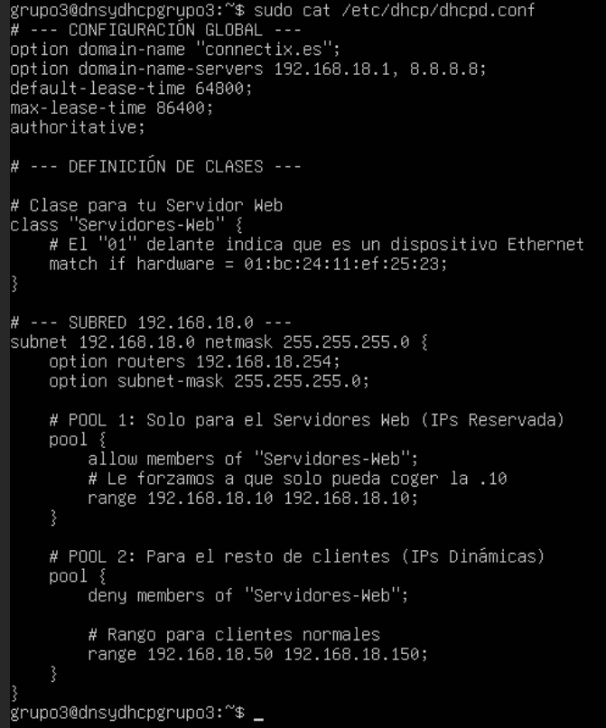
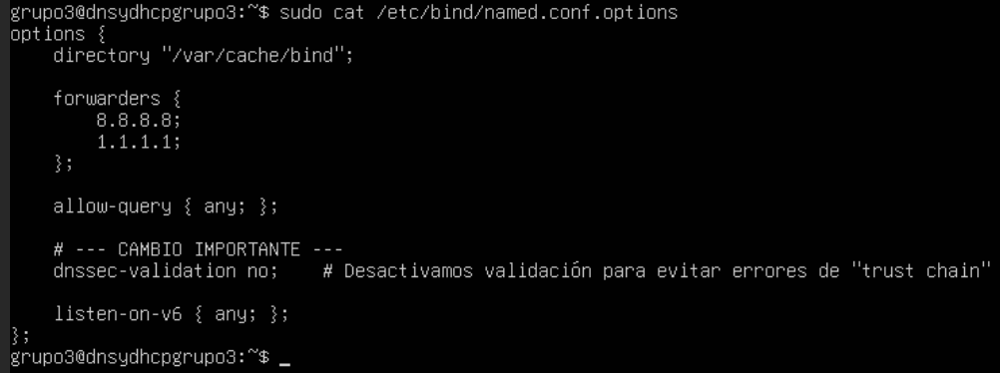
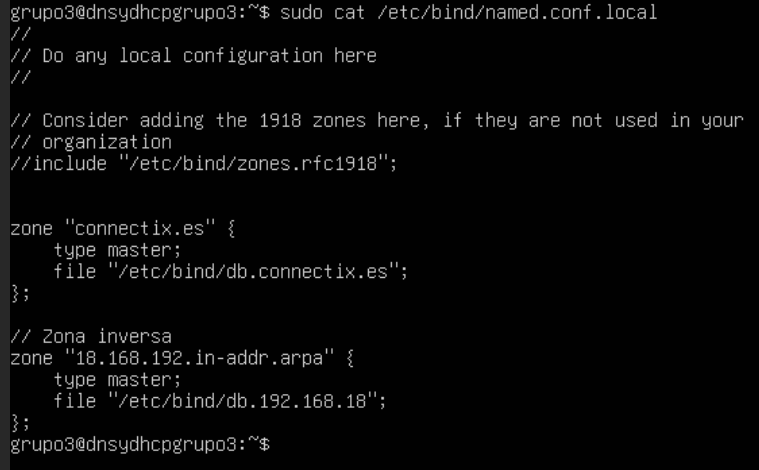
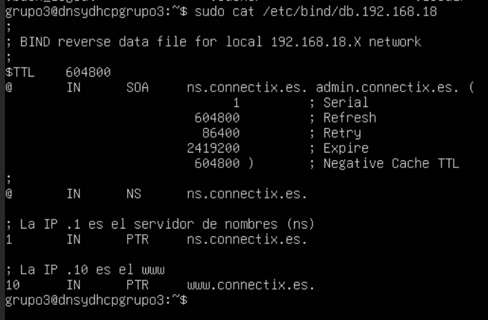
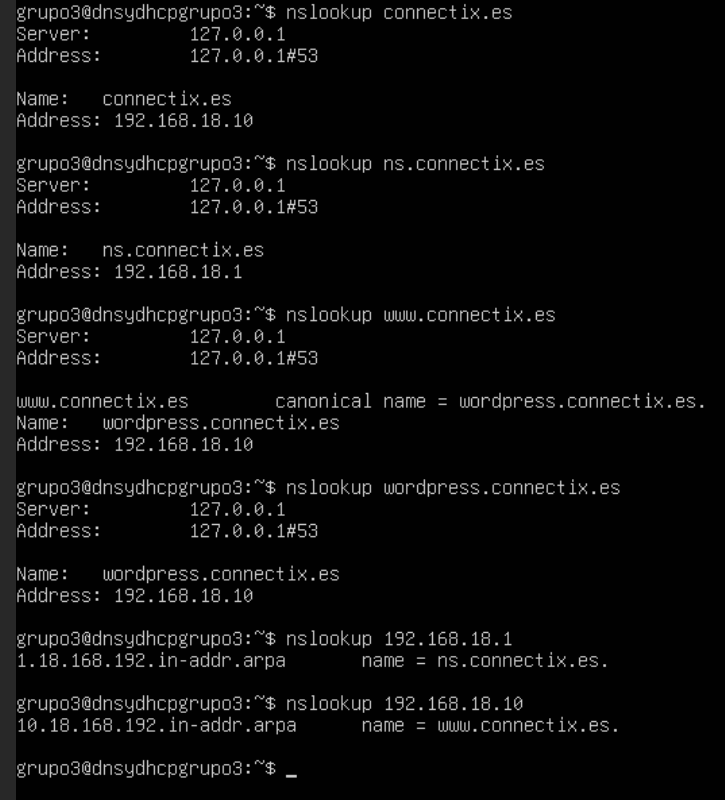
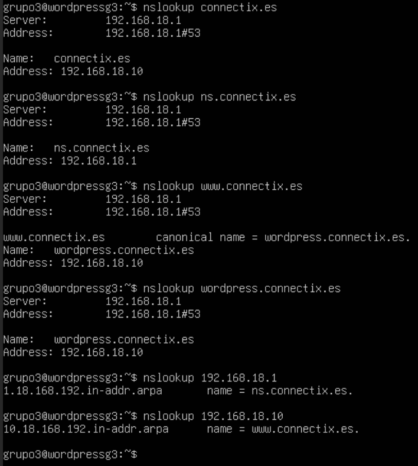

## ÍNDICE
1. [Configuración del Servidor de Infraestructura (DNS y DHCP)](#1-configuración-del-servidor-de-infraestructura-dns-y-dhcp)
   - 1.1 [Configuración del Servicio DHCP](#11-configuración-del-servicio-dhcp)
   - 1.2 [Configuración del Servicio DNS](#12-configuración-del-servicio-dns)
   - 1.3 [Configuración del Resolver Local (`resolv.conf`)](#13-configuración-del-resolver-local-resolvconf)
2. [Adaptación del DHCP para Alta Disponibilidad (Clúster)](#2-adaptación-del-dhcp-para-alta-disponibilidad-clúster)
3. [Modificación del Servidor DNS](#3-modificación-del-servidor-dns)

# 1. Configuración del Servidor de Infraestructura (DNS y DHCP)
El servidor `dnsydhcpgrupo3` actúa como el controlador principal de la red interna, proporcionando direccionamiento IP dinámico y resolución de nombres.

## 1.1. Configuración del Servicio DHCP
Se utiliza `isc-dhcp-server`. La configuración define el dominio `connectix.es`, los servidores DNS que se entregarán a los clientes y dos pools de direcciones: uno reservado para servidores web y otro para clientes generales.

**Archivo:** `/etc/dhcp/dhcpd.conf`

```conf
option domain-name "connectix.es";
option domain-name-servers 192.168.18.1, 8.8.8.8;
default-lease-time 64800;
max-lease-time 86400;
authoritative;

class "Servidores-Web" {
    match if hardware = 01:bc:24:11:ef:25:23;
}

subnet 192.168.18.0 netmask 255.255.255.0 {
    option routers 192.168.18.254;
    option subnet-mask 255.255.255.0;
    pool {
        allow members of "Servidores-Web";
        range 192.168.18.10 192.168.18.10;
    }
    pool {
        deny members of "Servidores-Web";
        range 192.168.18.50 192.168.18.150;
    }
}
```


---

## 1.2. Configuración del Servicio DNS
Se configura Bind9 para resolver el dominio local.

### 1.2.1 Opciones Globales y Reenvío
Se configuran los "forwarders" (reenviadores) para que el servidor sepa preguntar a Google si no conoce un dominio. Además, se desactiva `dnssec-validation` para evitar errores de validación en entornos de laboratorio.

**Archivo:** `/etc/bind/named.conf.options`

```bind
options {
    directory "/var/cache/bind";
    forwarders {
        8.8.8.8;
        1.1.1.1;
    };
    allow-query { any; };
    dnssec-validation no;
    listen-on-v6 { any; };
};
```


### 1.2.2 Declaración de Zonas Locales
Se definen las zonas maestra directa (`connectix.es`) e inversa (`18.168.192.in-addr.arpa`).

**Archivo:** `/etc/bind/named.conf.local`

```bind
zone "connectix.es" {
    type master;
    file "/etc/bind/db.connectix.es";
};
// Zona inversa
zone "18.168.192.in-addr.arpa" {
    type master;
    file "/etc/bind/db.192.168.18";
};
```


### 1.2.3 Archivo de Zona Directa
Define la traducción de nombres a IPs. Se incluye un registro `CNAME` para que `www` apunte a `wordpress`.

**Archivo:** `/etc/bind/db.connectix.es`

```bind
; BIND data file for connectix.es
$TTL    604800
@       IN      SOA     ns.connectix.es. admin.connectix.es. (
                              2         ; Serial
                         604800         ; Refresh
                          86400         ; Retry
                        2419200         ; Expire
                         604800 )       ; Negative Cache TTL
;
@       IN      NS      ns.connectix.es.

ns          IN      A       192.168.18.1  
wordpress   IN      A       192.168.18.10 
www         IN      CNAME   wordpress
@           IN      A       192.168.18.10
```


### 1.2.4 Archivo de Zona Inversa
Define la traducción de IPs a nombres (PTR).

**Archivo:** `/etc/bind/db.192.168.18`

```bind
; BIND reverse data file for local 192.168.18.X network
$TTL    604800
@       IN      SOA     ns.connectix.es. admin.connectix.es. (
                              1         ; Serial ...
                         ... )
;
@       IN      NS      ns.connectix.es.
1       IN      PTR     ns.connectix.es.
10      IN      PTR     www.connectix.es.
```


---

## 1.3. Configuración del Resolver Local (`resolv.conf`)
Para garantizar que los 2 servidores utilicen su propio servicio Bind9 y resuelva correctamente las zonas locales, se configuró manualmente el archivo `/etc/resolv.conf`.

**Archivo:** `/etc/resolv.conf`

```text
nameserver 127.0.0.1 (o 192.168.18.1 en el caso de Server WEB)
options edns0 trust-ad
search connectix.es       # Dominio de búsqueda
```

**Verificación:**
Usamos el comando nslookup para comprobar que todas las zonas funcionan, en ambos servers.



---

# 2. Adaptación del DHCP para Alta Disponibilidad (Clúster)
Para implementar el balanceo de carga con Nginx, es un requisito indispensable que los nodos backend (`wordpress-nodo1` y `wordpress-nodo2`) mantengan direcciones IP fijas e inmutables. Si las IPs cambiaran dinámicamente tras un reinicio, el balanceador perdería la conexión con los servidores web.

Por ello, se ha modificado la configuración del servidor ISC-DHCP-Server para asignar direcciones estáticas basadas en la dirección MAC.

## 2.1. Archivo de Configuración
**Ruta:** `/etc/dhcp/dhcpd.conf`

Se han realizado tres modificaciones críticas en la estructura del archivo:

1. **Ampliación de la Clase de Seguridad:** Se ha añadido la MAC del nodo clonado a la lista blanca (`allow`) usando el operador lógico `or`.
2. **Expansión del Pool:** Se ha ampliado el rango de IPs reservadas para incluir la `.10` y la `.11`.
3. **Reservas Estáticas (Hosts):** Se han definido las asignaciones fijas fuera de la subred para garantizar la identidad de cada nodo.

## 2.2. Código Implementado

A continuación se muestra la configuración final aplicada:

```bash
# --- DEFINICIÓN DE CLASES ---

# Clase para los Servidores Web del Clúster
class "Servidores-Web" {
    # Se autorizan las MACs del Nodo 1 (Original) Y del Nodo 2 (Clon)
    match if hardware = 01:bc:24:11:ef:25:23 or hardware = 01:bc:24:11:66:91:63;
}

# --- SUBRED 192.168.18.0 ---
subnet 192.168.18.0 netmask 255.255.255.0 {
    option routers 192.168.18.254;
    option subnet-mask 255.255.255.0;

    # POOL 1: Rango Exclusivo para Servidores Web
    pool {
        allow members of "Servidores-Web";
        # Rango ampliado para cubrir ambos nodos
        range 192.168.18.10 192.168.18.11;
    }

    # POOL 2: Resto de clientes (IPs Dinámicas)
    pool {
        deny members of "Servidores-Web";
        range 192.168.18.50 192.168.18.150;
    }
}

# --- RESERVAS ESTÁTICAS (HARD-CODED) ---
# Necesario para que Nginx siempre encuentre a los backends en la misma IP

host wordpress-nodo1 {
    hardware ethernet bc:24:11:ef:25:23;
    fixed-address 192.168.18.10;
}

host wordpress-nodo2 {
    hardware ethernet bc:24:11:66:91:63;
    fixed-address 192.168.18.11;
}
```

## 2.3. Corrección de Errores de Sintaxis
Durante la configuración, se identificó y corrigió un error de sintaxis en la directiva `range`.

* **Incorrecto:** `range 192.168.18.10 192.168.18.10 192.168.18.11;` (El servicio fallaba al recibir 3 argumentos).
* **Correcto:** `range 192.168.18.10 192.168.18.11;` (Define inicio y fin del rango).

## 2.4. Aplicación y Verificación
Para aplicar los cambios, se reinició el servicio y se verificó que el nodo clonado (`wordpress-nodo2`) recibiera la configuración correcta.

```bash
# Reinicio del servicio
sudo systemctl restart isc-dhcp-server
# Verificación de estado
sudo systemctl status isc-dhcp-server
```
* **Resultado:** El servicio está activo (`active running`) y la VM 102 ha obtenido la IP `192.168.18.11` correctamente tras el reinicio.
---

# 3. Modificación del Servidor DNS
Para que el cliente externo (Windows) acceda al clúster, el servidor DNS debe apuntar los registros del dominio a la IP del "punto de entrada" (Proxmox), permitiendo que las reglas de NAT procesen la petición.

## 3.1. Archivo de Zona

**Archivo:** `/etc/bind/db.connectix.es`

Se configuraron los registros **A** para que resuelvan a la IP de la red externa de Proxmox, actuando esta como pasarela hacia el balanceador.

```bash
; --- Fragmento del archivo de zona ---
; Registro A para el nombre del servidor DNS
ns      IN      A       192.168.18.1
; Registros principales apuntando a la IP de Proxmox (NAT)
@       IN      A       172.16.204.233
wordpress IN    A       172.16.204.233
; Alias CNAME para www
www     IN      CNAME   wordpress
```

## 3.2. Comandos de Gestión DNS

```bash
# Verificar la sintaxis de los archivos de configuración
sudo named-checkconf
# Verificar la sintaxis del archivo de zona específico
sudo named-checkzone connectix.es /etc/bind/db.connectix.es
# Reiniciar Bind9 para aplicar los cambios
sudo systemctl restart bind9
```

## 3.3. Verificación desde el Cliente (Windows)
Es vital que el comando `nslookup` devuelva la IP externa para asegurar que el tráfico pase por el firewall de Proxmox:

``cmd
    nslookup www.connectix.es
    # Resultado esperado:
    # Nombre: wordpress.connectix.es
    # Address: 172.16.204.233
```
