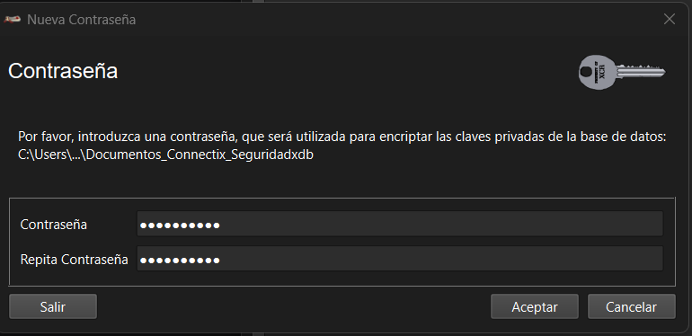
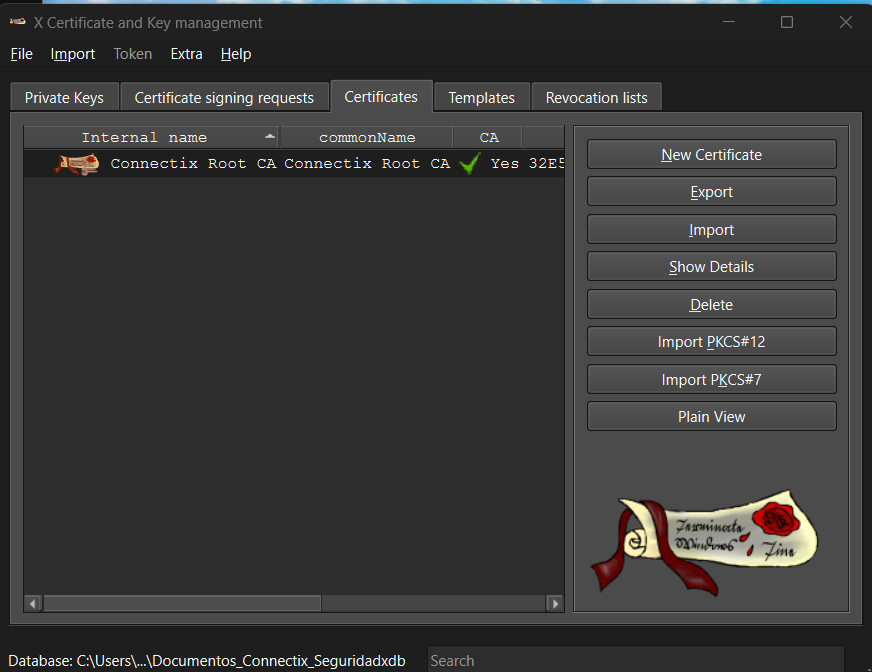
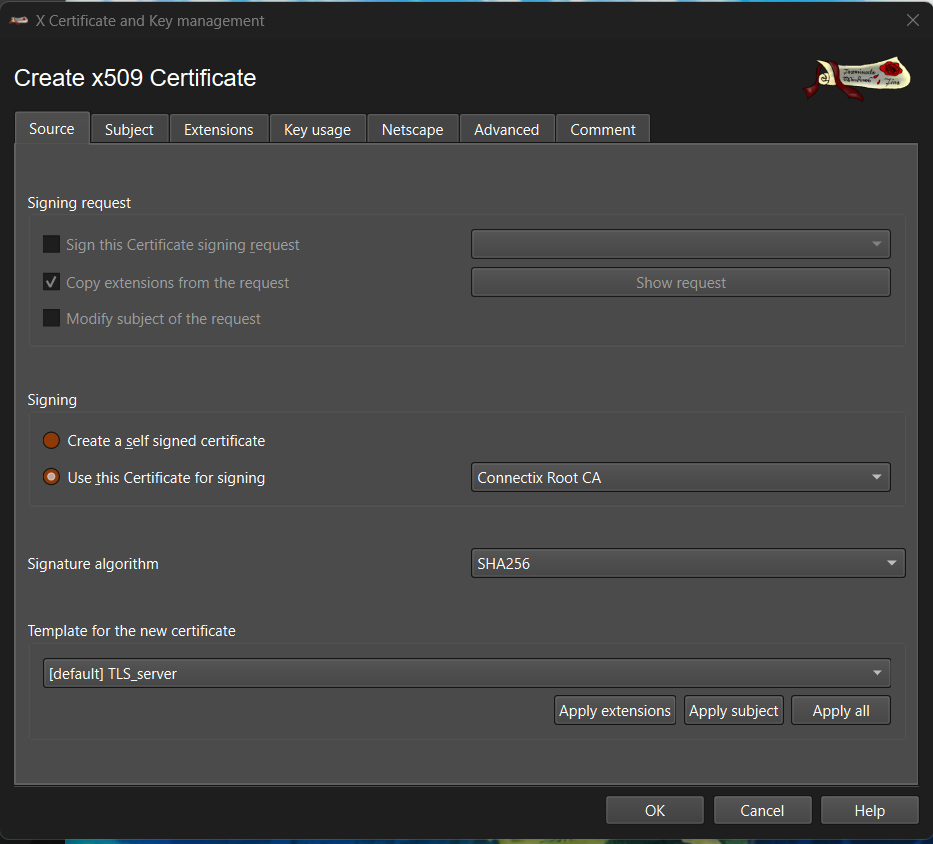
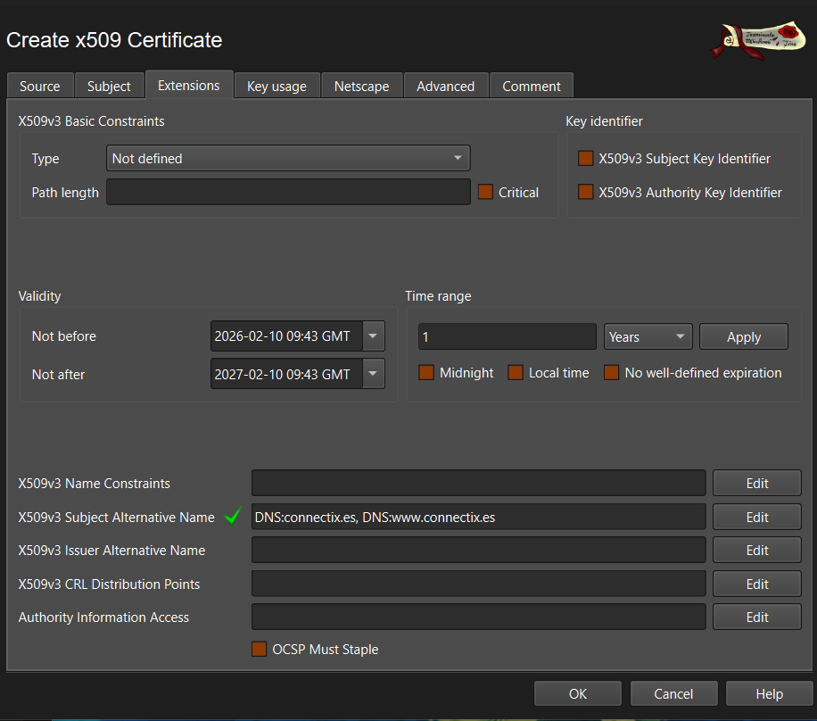

# Despliegue de Clúster WordPress con Nginx (HTTPS) y Balanceo de Carga
Esta guía detalla los pasos para desplegar una infraestructura segura con **certificados propios (XCA)**, balanceo de carga con **Nginx** y persistencia de sesiones en un clúster de **WordPress**.
---

## 1. Generación de Certificados (XCA)
Usamos **XCA** en Windows para actuar como nuestra propia Autoridad Certificadora (CA).

### A. Instalación y Preparación
1. Descargar el instalador `.msi` de [XCA Releases](https://github.com/chris2511/xca/releases).
2. Abrir XCA y crear una base de datos nueva: **File** > **New DataBase** y nos pedirá contraseña.


### B. Crear la Autoridad (Root CA)
Este certificado firmará a los demás.

1. Pestaña **Certificates** > **New Certificate**.
2. **Source:**
* *Template:* `[default] CA`.
* Clic en **Apply all**.

3. **Subject:**
* *Internal Name:* `Connectix Root CA`.
* *commonName:* `Connectix Root CA`.
* *Private Key:* Clic en **Generate a new key** (4096 bit).

4. **Extensions:** Verificar que *Type* sea `Certification Authority`.
5. Clic en **OK**.


### C. Crear el Certificado del Servidor (HTTPS)
Este es el certificado que usará Nginx.

1. Pestaña **Certificates** > **New Certificate**.
2. **Source:**
* *Signing:* **Use this certificate for signing: Connectix Root CA**.
* *Template:* `[default] TLS_server`.
* Clic en **Apply all**.


3. **Subject:**
* *Internal Name:* `connectix.es_server`.
* *commonName:* `connectix.es`.
* *Private Key:* Clic en **Generate a new key** (4096 bit).

4. **Extensions:**
* Editar **X509v3 Subject Alternative Name**.
* Añadir: `DNS:connectix.es, DNS:www.connectix.es`.


5. Clic en **OK**.

### D. Exportación
| Archivo Exportado | Tipo de Archivo | Privacidad | Propietario / Uso |
| :--- | :--- | :--- | :--- |
| **`root_ca.crt`** | Certificado de Autoridad (CA) | **PÚBLICA** | **La Autoridad (Jefe)**<br>Se instala en los navegadores/Windows para dar confianza. |
| **`connectix.crt`** | Certificado de Servidor | **PÚBLICA** | **El Servidor Nginx**<br>Se envía a los visitantes para demostrar que es `connectix.es`. |
| **`connectix.key`**<br>*(o `.pem`)* | Llave Privada | **PRIVADA** | **El Servidor Nginx**<br>Nunca debe salir del servidor. Sirve para descifrar el tráfico. |

## 2. Transferencia de Claves (SCP)
Debido a la red aislada, usamos Proxmox como puente ("Salto de Rana").

### Paso 1: Windows → Proxmox (172.16.204.233)
Abrir PowerShell en la carpeta de los certificados:

```powershell
scp connectix.crt root@172.16.204.233:/tmp/
scp connectix.pem root@172.16.204.233:/tmp/
```
### Paso 2: Proxmox → VM Nginx (192.168.18.1)
Conectar por SSH a Proxmox y enviar los archivos a la VM interna renombrándolos para estandarizar:

```bash
# Desde la consola de Proxmox
scp /tmp/connectix.crt grupo3@192.168.18.1:/tmp/nginx.crt
scp /tmp/connectix.pem grupo3@192.168.18.1:/tmp/nginx.key
```
### Paso 3: Instalación en Nginx
Conectar por SSH a la VM Nginx (`ssh grupo3@192.168.18.1`) y ejecutar:

```bash
sudo mkdir -p /etc/nginx/ssl
sudo mv /tmp/nginx.crt /etc/nginx/ssl/nginx.crt
sudo mv /tmp/nginx.key /etc/nginx/ssl/nginx.key
# Permisos de seguridad (solo root lee la llave)
sudo chmod 644 /etc/nginx/ssl/nginx.crt
sudo chmod 600 /etc/nginx/ssl/nginx.key
```
---
## 3. Configuración de Nginx (Balanceador)
Archivo: `/etc/nginx/sites-available/default`
Esta configuración fuerza HTTPS, gestiona los certificados y usa `ip_hash` para evitar que la sesión de WordPress se rompa al saltar entre servidores.

```bash
# --- CLÚSTER WORDPRESS ---
upstream backend_wordpress {
    ip_hash;  # Mantiene al usuario en el mismo servidor (Sticky Session)
    server 192.168.18.10;
    server 192.168.18.11;
}

# --- REDIRECCIÓN HTTP -> HTTPS ---
server {
    listen 80;
    server_name connectix.es www.connectix.es;
    return 301 https://$host$request_uri;
}

# --- SERVIDOR HTTPS ---
server {
    listen 443 ssl;
    server_name connectix.es www.connectix.es;

    # Certificados
    ssl_certificate /etc/nginx/ssl/nginx.crt;
    ssl_certificate_key /etc/nginx/ssl/nginx.key;

    # Protocolos Seguros
    ssl_protocols TLSv1.2 TLSv1.3;
    ssl_ciphers HIGH:!aNULL:!MD5;

    location / {
        proxy_pass http://backend_wordpress;

        # Cabeceras para WordPress
        proxy_set_header Host $host;
        proxy_set_header X-Real-IP $remote_addr;
        proxy_set_header X-Forwarded-For $proxy_add_x_forwarded_for;
        proxy_set_header X-Forwarded-Proto https; # Vital para SSL
    }
}
```
*Reiniciar:* `sudo systemctl restart nginx`
---
## 4. Configuración de WordPress (Nodos Web)
Estos cambios deben aplicarse en **AMBOS** servidores (192.168.18.10 y .11).

### A. Archivo `wp-config.php`

Ruta: `/opt/lampp/htdocs/wordpress/wp-config.php`.
Añadir al principio, después de `<?php`:

```php
/* --- FORZAR HTTPS DETRÁS DE PROXY --- */
if (isset($_SERVER['HTTP_X_FORWARDED_PROTO']) && $_SERVER['HTTP_X_FORWARDED_PROTO'] === 'https') {
    $_SERVER['HTTPS'] = 'on';
}

define( 'WP_HOME', 'https://www.connectix.es' );
define( 'WP_SITEURL', 'https://www.connectix.es' );
define( 'WP_CONTENT_DIR', '/opt/lampp/htdocs/wordpress/wp-content' );
define( 'WP_CONTENT_URL', 'https://www.connectix.es/wp-content' );
```

### B. Actualización de Base de Datos

Ejecutar en MySQL (`sudo /opt/lampp/bin/mysql -u root`):

```sql
USE grupo3;
UPDATE wp_options SET option_value = 'https://www.connectix.es' WHERE option_name = 'siteurl';
UPDATE wp_options SET option_value = 'https://www.connectix.es' WHERE option_name = 'home';
UPDATE wp_posts SET post_content = REPLACE(post_content, 'http://www.connectix.es', 'https://www.connectix.es');
```
*Reiniciar Apache:* `sudo /opt/lampp/lampp stopapache && sudo /opt/lampp/lampp startapache`

---
## 5. Confianza en el Cliente (Windows)
Para ver el "Candado Verde" en el navegador y evitar advertencias de seguridad.

1. Copiar `root_ca.crt` al escritorio de Windows.
2. Ejecutar `certmgr.msc` (Administrador de certificados).
3. Ir a **Entidades de certificación raíz de confianza** > **Certificados**.
4. Clic derecho > **Todas las tareas** > **Importar**.
5. Seleccionar `root_ca.crt` y confirmar la instalación.
---

### Resultado Final
* Acceso seguro mediante `https://www.connectix.es`.
* Redirección automática desde HTTP.
* Login en `/wp-admin` funcional gracias a `ip_hash`.
* Alta disponibilidad: Si un nodo cae, el otro responde.