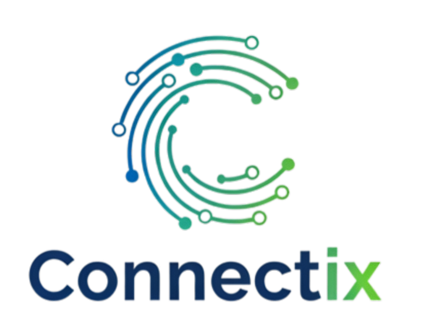

  

# Connectix – Conecta. Optimiza. Avanza

Connectix es un proyecto enfocado en el diseño e implementación de infraestructura tecnológica integral para pequeñas y medianas empresas (PYMEs) del sector logístico. Nuestro objetivo es proporcionar un Servidor "Todo-en-Uno" (Connectix Hub) que aloja de forma segura todos los servicios esenciales (ERP, GPS, Web, LDAP), sustituyendo la fragmentación de sistemas y unificando el flujo de información.

Este repositorio contiene toda la documentación del proyecto, dividida en sus componentes principales: el modelo de negocio, la infraestructura técnica y la gestión del desarrollo.
---

## Tabla de Contenidos

* [1. Plan de Empresa (Connectix)](#1-plan-de-empresa-connectix)
* [2. Infraestructura (Servidor Proxmox)](#2-infraestructura-servidor-proxmox)
* [3. Gestión del Proyecto (GitHub)](#3-gestión-del-proyecto-github)
* [Autores](#-autores)

---

## Estructura del Repositorio

Este repositorio está organizado en varias carpetas principales. Este fichero es la visión general del proyecto.

Para obtener información detallada sobre cada componente, por favor, consulta el `README.md` secundario que se encuentra dentro de cada carpeta respectiva.

### 1. Plan de Empresa (Connectix)

Esta sección contiene todo el análisis de negocio y el informe profesional del proyecto Connectix. Incluye el modelo de negocio, la propuesta de valor, el análisis de mercado, los segmentos de clientes y el plan de viabilidad.

➡️ **Ver detalles en: [./Empresa/README.md](./Empresa/README.md)**

### 2. Infraestructura (Servidor Proxmox)

Aquí se documenta la configuración y gestión de la infraestructura de desarrollo y pruebas. Se utiliza Proxmox para virtualizar los diferentes componentes del sistema.

➡️ **Ver detalles en: [./Proxmox/README.md](./Proxmox/README.md)**

### 3. Gestión del Proyecto (GitHub)

Esta carpeta define nuestro flujo de trabajo y cómo utilizamos las herramientas de GitHub para gestionar el desarrollo del proyecto. Incluye nuestra metodología GitFlow, el uso de GitHub Projects  para el seguimiento de tareas (Issues) y el proceso estandarizado de Pull Requests (PRs).

➡️ **Ver detalles en: [./Github/README.md](./Github/README.md)**

---

## 👥 Autores

* Shahzaib Waheed
* Aarón Vizcaíno
* Alessandro Moscatelli

* Jacobo Navarro
